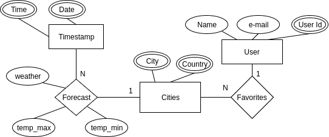

## Umbrellapp reference manual:

### To get, create, delete, update users make the following api calls:
```php
User.fillable.fields = ['Name','e-mail']
User.fields = ['User Id', 'Name', 'e-mail']
```

- Get all Users  
`GET: '/api/users'`

- Get User by "User Id"  
`GET: '/api/users/{id}'`

- Get User by "Name", "e-mail"  
`GET: '/api/users/name/{name}/email/{email}'`

- Create a new User (name,email)  
`POST: '/api/users'`

- Update a User by Id (name,email)  
`PUT: '/api/users/{id}'`

- Delete a User by Id  
`DELETE: '/api/users/{id}'`

- Delete a User by "Name", "e-mail"  
`DELETE: '/api/users/name/{name}/email/{email}'`

### To get, create, delete, update cities make the following api calls:
```php
Cities.fillable.fields = ['City','Country']
Cities.fields = ['City','Country']
```
- Check if a city exists (response: 200)
`GET: '/api/cities/exists/city/{city}/country/{country}'`

- Create a new city (city,country)  
`POST: '/api/cities'`

- Delete a city
`DELETE: '/api/cities/city/{city}/country/{country}'`

### To get, create, delete, update favorites make the following api calls:
```php
Favorites.fillable.fields = ['User','City','Country']
Favorites.fields = ['User','City','Country']
```
- Get all the favorites of a user (by id)  
`GET: '/api/favorites/{id}'`

- Create new Favorite (user,city,country)  
`POST: '/api/favorites'`

- Delete all favorites of a user (by id)  
`DELETE: '/api/favorites/{id}'`

- Delete a certain user favorite (id,city,country)
`DELETE: '/api/favorites/{id}/city/{city}/country/{country}'`

### To get, create, delete, update forecasts make the following api calls:
```php
Forecasts.fillable.fields = ['City','Country','Date','Time','weather','temp_min',temp_max']
Forecasts.fillable.fields = ['City','Country','Date','Time','weather','temp_min',temp_max']`
```
- Get all forecasts  
`GET: '/api/forecasts'`

- Get all forecasts for a city  
`GET: '/api/forecasts/city/{city}/country/{country}'`

- Get all forecast for a certain date
`GET: '/api/forecasts/city/{city}/country/{country}/date/{date}'`

- Create new forecast (city,country,date,time,weather\_type, min\_temperature, max\_temperature)  
`POST: '/api/forecasts'`

- Update a forecast for a city, country, date, time
`PUT: '/api/forecasts/city/{city}/country/{country}/date/{date}/time/{time}'`

- Delete a forecast for a city, country, date, time
`DELETE: 'forecasts/city/{city}/country/{country}/date/{date}/time/{time}'`

## Entity relation Diagram:

